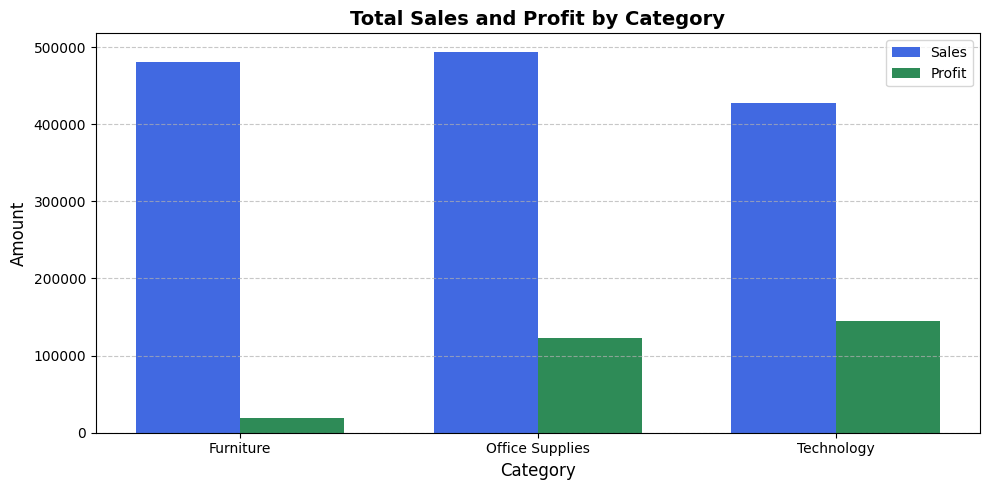
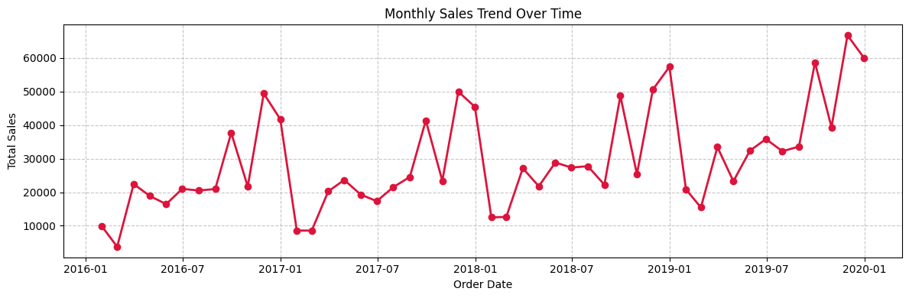
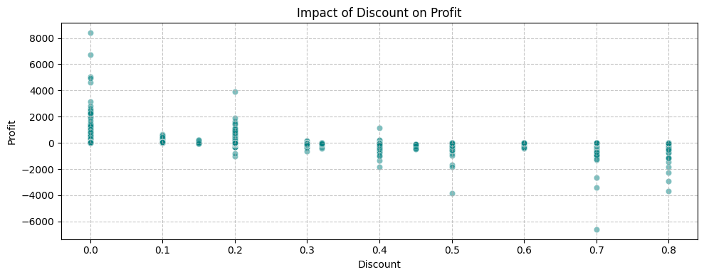

# Superstore Data Analysis Using Python

## Project Overview

This project analyzes the Superstore 2019 dataset using Python to clean, transform, explore, and visualize sales data.

The analysis covers sales, profit, customers, regions, product categories, shipping methods, and discounts to better understand the structure and performance of the dataset.

## Objectives

* Clean and prepare the dataset for analysis
* Remove duplicate records
* Handle and transform date columns
* Create new analytical features
* Detect and handle sales outliers
* Perform exploratory data analysis
* Generate statistical summaries and correlations
* Analyze sales and profit across different dimensions
* Create meaningful data visualizations
* Generate automated KPI summaries
* Export cleaned data and visual reports

## Tools & Technologies

* Python
* Pandas
* NumPy
* Matplotlib
* Seaborn
* Jupyter Notebook
* Excel

## Data Cleaning & Feature Engineering

The project includes several data preparation steps:

* Removing duplicate records
* Converting Order Date and Ship Date to datetime
* Creating Shipping Duration
* Calculating Profit Margin
* Creating Sales Performance Categories
* Checking missing values
* Checking unique values in categorical columns
* Optimizing memory usage using categorical data types
* Detecting and capping Sales outliers using the IQR method

## Exploratory Data Analysis

The project performs statistical and exploratory analysis including:

* Descriptive statistics
* Correlation analysis
* Sales and Profit relationships
* Missing value analysis
* Categorical data analysis
* Sales performance analysis across different business dimensions

## Visualizations

The project includes 8 visualizations:

1. Total Sales and Profit by Category
2. Profit Distribution
3. Sales and Profit by Region
4. Sales Share by Customer Segment
5. Monthly Sales Trend
6. Discount vs Profit
7. Top 10 Sub-Categories by Sales
8. Ship Mode Distribution

### Sales and Profit by Category



### Monthly Sales Trend



### Discount vs Profit




## KPI Analysis

An automated KPI summary is generated containing:        

* Total Sales            : $1,401,969.37
* Total Profit           : $286,397.02
* Avg Profit Margin      : 12.03%
* Top Sales Category     : Office Supplies


## Output

The project can export:

* Cleaned Superstore dataset as a CSV file
* Visual summary report as a PNG image

## Project Structure

```text
Superstore-python-data-analysis/
│
├── README.md
├── Superstore_Analysis.ipynb
│
└── output/
    ├── Cleaned_Superstore.csv
    └── Visual_Summary_Report.png
```

## Key Skills Demonstrated

* Data Cleaning
* Data Preprocessing
* Feature Engineering
* Exploratory Data Analysis
* Statistical Analysis
* Outlier Detection
* Data Visualization
* KPI Reporting
* Python
* Pandas
* NumPy
* Matplotlib
* Seaborn
* Object-Oriented Programming

## Author

Abdelrahman Ahmed Abdelshafi
